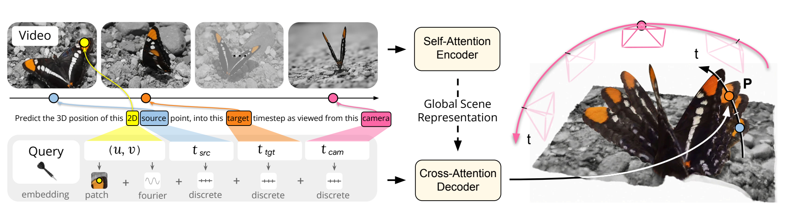

<div align="center">
  <h1>OpenD4RT</h1>
  <h3>An unofficial PyTorch/GPU implementation of D4RT for 4D reconstruction and tracking</h3>
  <p>
    <a href="https://d4rt-paper.github.io/" target="_blank">
      
    </a>
    <a href="docs/D4RT_paper.pdf">
      
    </a>
    <a href="https://huggingface.co/Lijiaxin0111/OpenD4RT/tree/main/checkpoints" target="_blank">
      
    </a>
    <a href="LICENSE">
      
    </a>
  </p>
  <p>
    
    
    
    
  </p>
  <p><strong>OpenD4RT reproduces D4RT-style 4D reconstruction and tracking with released WorldTrack evaluation, visualization tools, and Hugging Face checkpoints.</strong></p>
</div>

OpenD4RT is an unofficial open-source PyTorch/GPU implementation of D4RT,
developed to reproduce the model architecture, training recipe, evaluation
protocols, and implementation details described in the D4RT paper and
appendix. The current public repo includes the released Hugging Face
checkpoint, the model, WorldTrack evaluation, and Viser visualization
tools, with complete training and evaluation code planned for release.

<p align="center">
  
</p>

## What is D4RT?

D4RT is a feedforward video model for reconstructing and tracking dynamic
scenes. It uses a unified transformer architecture to infer depth,
spatio-temporal correspondence, and camera parameters from a single video. Its
query interface probes the 3D position of a source pixel `(u, v, t_src)` at a
target timestep `t_tgt` in a selected camera coordinate frame `t_cam`, enabling
sparse tracking, all-pixel tracking, and 4D scene reconstruction through the
same model interface.

See [docs/D4RT_paper.pdf](docs/D4RT_paper.pdf) for the local paper PDF
included in this repository.

## Checkpoint Zoo

| Variant | Data | Aug. | Frames | Status | Download |
| --- | --- | --- | ---: | --- | --- |
| `32CLIP_9Dataset_NoAUG` | 9Mix | No color/crop | 32 | Released | [HF](https://huggingface.co/Lijiaxin0111/OpenD4RT/tree/main/checkpoints/OpenD4RT_32CLIP_9Dataset_NoAUG) |
| `48CLIP_9Mix_NoCropAUG` | 9Mix | No crop | 48 | Coming | TBD |
| `48CLIP_9Mix_AUG` | 9Mix | Yes | 48 | Coming | TBD |
| `32CLIP_10Mix_SynthVerse_NoAUG` | 10Mix | No | 32 | Coming | TBD |
| `48CLIP_10Mix_SynthVerse_AUG` | 10Mix | Yes | 48 | Coming | TBD |

Released checkpoint local path:
`checkpoints/OpenD4RT_32CLIP_9Dataset_NoAUG/opend4rt.ckpt`.

Tip: all rows are OpenD4RT variants. The 9Mix setting uses PointOdyssey,
Dynamic Replica, Kubric Full,
TartanAir, Virtual KITTI 2, ScanNet, BlendedMVS, CO3D, and MVS-Synth. The
10Mix setting additionally includes SynthVerse.

## Checkpoint Download

Download the released checkpoint and model config from
[Lijiaxin0111/OpenD4RT](https://huggingface.co/Lijiaxin0111/OpenD4RT/tree/main/checkpoints)
into the default path used by the scripts:

```bash
pip install -U huggingface_hub

huggingface-cli download Lijiaxin0111/OpenD4RT \
  --repo-type model \
  --include "checkpoints/OpenD4RT_32CLIP_9Dataset_NoAUG/opend4rt.ckpt" \
  --include "checkpoints/OpenD4RT_32CLIP_9Dataset_NoAUG/model.yaml" \
  --local-dir .
```

Expected local files:

```text
checkpoints/OpenD4RT_32CLIP_9Dataset_NoAUG/
  opend4rt.ckpt
  model.yaml
```

## Installation

Create the conda environment:

```bash
conda env create -f environment.yml
conda activate d4rt
```

Or install into an existing Python environment:

```bash
pip install -r requirements.txt
```

The visualization package builder calls the `ffmpeg` command-line tool to
write MP4 assets for Viser. The conda environment includes `ffmpeg`; if you use
`pip install -r requirements.txt`, install `ffmpeg` separately if needed.

## WorldTrack Data

Download the WorldTrack release from:

```text
https://drive.google.com/drive/folders/1-JW88ru30irMYyFab_4YBQbGbd9tKpXV
```

Place the `.npz` files under:

```text
data/worldtrack_release/
  adt_mini/*.npz
  po_mini/*.npz
  pstudio_mini/*.npz
  ds_mini/*.npz
```

## Evaluation

Run a quick smoke test on one `adt_mini` sequence:

```bash
LIMIT_SEQS=1 SUBSETS=adt_mini OUTPUT_DIR=tmp/eval_smoke bash run_eval_worldtrack.sh
```

Run the full WorldTrack evaluation:

```bash
bash run_eval_worldtrack.sh
```

Equivalent explicit command:

```bash
EXP=checkpoints/OpenD4RT_32CLIP_9Dataset_NoAUG

python eval_track3d_in_worldtrack.py \
  --model-config "$EXP/model.yaml" \
  --ckpt-path "$EXP/opend4rt.ckpt" \
  --data-root data/worldtrack_release \
  --subsets adt_mini,po_mini,pstudio_mini,ds_mini \
  --num-frames 64 \
  --query-chunk-size 4096 \
  --output-dir tmp/eval_worldtrack \
  --device cuda \
  --save-per-sequence
```

Useful overrides:

```bash
QUERY_CHUNK_SIZE=1024 bash run_eval_worldtrack.sh
CUDA_VISIBLE_DEVICES=1 DEVICE=cuda bash run_eval_worldtrack.sh
SUBSETS=adt_mini LIMIT_SEQS=1 NUM_FRAMES=64 bash run_eval_worldtrack.sh
```

## Results

OpenD4RT_32CLIP_9Dataset_NoAUG detailed WorldTrack results:

| Subset | APD global | EPE global | APD global dyn | EPE global dyn | Queries |
| --- | ---: | ---: | ---: | ---: | ---: |
| `adt_mini` | 0.6993 | 0.2964 | 0.6975 | 0.3628 | 22187 |
| `po_mini` | 0.6603 | 0.3397 | 0.7333 | 0.2722 | 53468 |
| `pstudio_mini` | 0.7863 | 0.1811 | 0.7863 | 0.1811 | 8720 |
| `ds_mini` | 0.7266 | 0.2944 | 0.7521 | 0.2699 | 52462 |

## Model Results

Sparse point tracking comparison on WorldTrack-style subsets. Each cell reports
`APD / EPE`; APD is shown as a percentage, higher APD is better, and lower EPE
is better. Recent baseline numbers are transcribed from the sparse point
tracking table in the provided reference image. OpenD4RT uses this repository's
evaluation results, with `ds_mini` reported in the DR/DS column.

| Model | PO | DR/DS | ADT | PStudio |
| --- | ---: | ---: | ---: | ---: |
| SpaTrackerV2 (2025) | 69.57 / 0.3780 | 73.43 / 0.2732 | 92.22 / 0.0915 | 74.16 / 0.2272 |
| St4RTrack (2025) | 67.95 / 0.3140 | 73.74 / 0.2682 | 76.01 / 0.2680 | 69.67 / 0.2637 |
| TraceAnything (2025) | 39.83 / 1.0593 | 60.63 / 0.5758 | 75.65 / 0.2511 | 71.33 / 0.2727 |
| Any4D (2025) | 60.86 / 0.4194 | 68.39 / 0.3012 | 56.71 / 0.4320 | 60.03 / 0.3344 |
| V-DPM (2026) | 79.79 / 0.1994 | 76.38 / 0.2378 | 66.06 / 0.3426 | 76.36 / 0.1957 |
| **OpenD4RT_32CLIP_9Dataset_NoAUG** | 66.03 / 0.3397 | 72.66 / 0.2944 | 69.93 / 0.2964 | <mark>78.63 / 0.1811</mark> |

Highlighted cells indicate competitive OpenD4RT results among the recent
2025/2026 baselines in this comparison.

## Viser Demo Visualization

The demo script defaults to high-scoring WorldTrack cases selected from
`tmp/eval_worldtrack`, rather than an arbitrary first `.npz`. The ranking
prioritizes high APD, low EPE, and enough dynamic tracks for meaningful
visualization.

| Rank | Case | Subset | APD | EPE | Dyn. APD | Dyn. ratio |
| ---: | --- | --- | ---: | ---: | ---: | ---: |
| 1 | `juggle_5` | `pstudio_mini` | 0.9938 | 0.0555 | 0.9938 | 1.000 |
| 2 | `fec654-3_obj_source_left_1` | `ds_mini` | 0.9248 | 0.0919 | 0.9587 | 0.578 |
| 3 | `Apartment_release_meal_seq133_1` | `adt_mini` | 0.8783 | 0.1571 | 0.9960 | 0.810 |
| 4 | `cab_e_3rd_12` | `po_mini` | 0.8419 | 0.1677 | 0.8868 | 0.935 |

Build the default rank-1 Viser demo package. By default, the package uses the
first 64 frames to match the evaluation setting:

```bash
OUTPUT_DIR=tmp/worldtrack_demo bash run_build_worldtrack_demo.sh
```

Build another recommended case by rank:

```bash
DEMO_CASE_RANK=2 OUTPUT_DIR=tmp/worldtrack_demo_ds bash run_build_worldtrack_demo.sh
```

Or provide an explicit case:

```bash
DEMO_CASE=pstudio_mini/juggle_5.npz OUTPUT_DIR=tmp/worldtrack_demo bash run_build_worldtrack_demo.sh
```

Build all recommended cases into separate folders:

```bash
DEMO_CASE_RANK=1 OUTPUT_DIR=tmp/worldtrack_demo_pstudio_juggle bash run_build_worldtrack_demo.sh
DEMO_CASE_RANK=2 OUTPUT_DIR=tmp/worldtrack_demo_ds_fec654 bash run_build_worldtrack_demo.sh
DEMO_CASE_RANK=3 OUTPUT_DIR=tmp/worldtrack_demo_adt_meal bash run_build_worldtrack_demo.sh
DEMO_CASE_RANK=4 OUTPUT_DIR=tmp/worldtrack_demo_po_cab bash run_build_worldtrack_demo.sh
```

For a lighter/faster package, reduce the point and track counts:

```bash
OUTPUT_DIR=tmp/worldtrack_demo_small \
POINT_GRID_COLS=32 POINT_GRID_ROWS=32 POINT_MAX_POINTS=1024 TRACK_MAX_POINTS=96 \
bash run_build_worldtrack_demo.sh
```

Start the interactive Viser viewer:

```bash
python vis/serve_demo_viser.py --root tmp/worldtrack_demo --port 8081
```

Open the printed Viser URL in a browser. To inspect another generated case,
change `--root` to that package directory:

```bash
python vis/serve_demo_viser.py --root tmp/worldtrack_demo_ds_fec654 --port 8081
```

If a Viser server is already running, either stop it or use a different port:

```bash
python vis/serve_demo_viser.py --root tmp/worldtrack_demo_adt_meal --port 8082
```

The generated demo package contains `assets/demo_data.json`,
`assets/input_video.mp4`, rendered diagnostic videos, and `manifest.json`.

## ToDo

- [x] Release the OpenD4RT model runtime for the 32-frame 9-dataset checkpoint.
- [x] Release WorldTrack evaluation scripts and archived metrics.
- [x] Release Viser-based qualitative visualization tools.
- [ ] Release complete training code.
- [ ] Release additional checkpoints listed in the Checkpoint Zoo.
- [ ] Release SynthVerse evaluation results.
- [ ] Release full evaluation code for the benchmarks reported in the D4RT
  paper and appendix.

## License

OpenD4RT is an unofficial implementation and is not affiliated with or endorsed
by the original D4RT authors. The code in this repository is released under the
Apache 2.0 license; see [LICENSE](LICENSE). The D4RT paper, project page,
datasets, third-party assets, and upstream dependencies remain under their
respective licenses and terms.

## Citation

If OpenD4RT is useful for your research, please cite the original D4RT paper:

```bibtex
@article{zhang2025d4rt,
  title={Efficiently Reconstructing Dynamic Scenes One D4RT at a Time},
  author={Zhang, Chuhan and Le Moing, Guillaume and Koppula, Skanda and Rocco, Ignacio and Momeni, Liliane and Xie, Junyu and Sun, Shuyang and Sukthankar, Rahul and Barral, Jo{\"e}lle K. and Hadsell, Raia and Ghahramani, Zoubin and Zisserman, Andrew and Zhang, Junlin and Sajjadi, Mehdi S. M.},
  journal={arXiv preprint},
  year={2025}
}
```

Official D4RT project page: <https://d4rt-paper.github.io/>.

## Acknowledgements

This project is built upon the D4RT paper and official project materials. We
thank the original D4RT authors for introducing the D4RT formulation, releasing
the project page, and documenting the paper and appendix details that this
implementation follows. We also acknowledge the contributors and resources
credited on the official D4RT website, including colleagues who supported
project advice, manuscript feedback, early development, code review,
visualization, baseline comparisons, and data generation. We also thank the
splat viewer authors for the WebGL renderer used by the official D4RT
visualization pipeline. Please refer to the official D4RT project page for the
full original acknowledgements.
