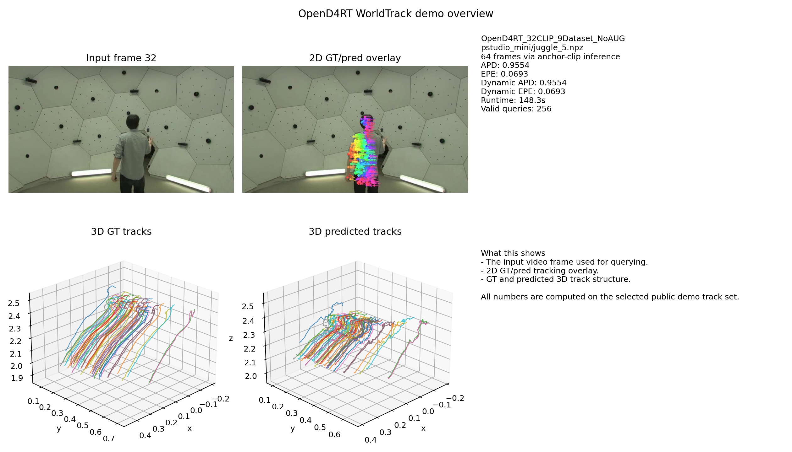
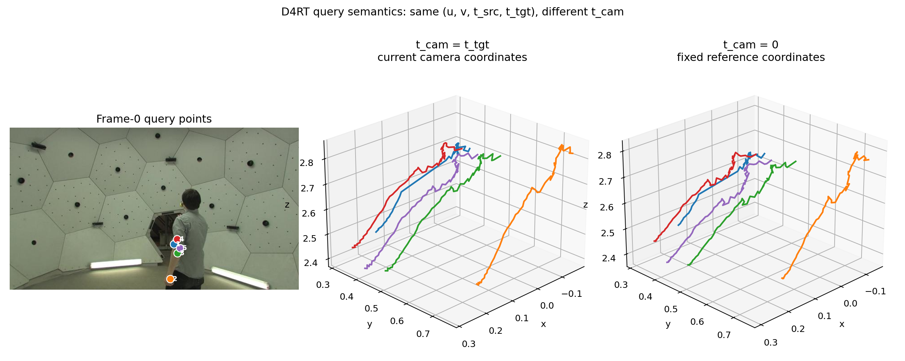
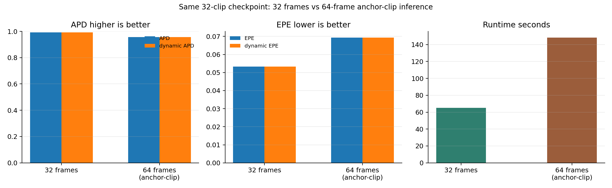

# OpenD4RT WorldTrack Inference and Analysis

English | [简体中文](README_zh-CN.md)

This fork keeps the original OpenD4RT codebase and adds a small, public set of
WorldTrack inference, evaluation, visualization, and analysis utilities. The
goal is to make the inference behavior easy to inspect: run OpenD4RT on
WorldTrack, compare a 32-frame clip with a 64-frame anchor-clip sequence, and
visualize the coordinate-frame meaning of the D4RT `t_cam` query argument.

This is not a full reproduction of the D4RT paper. I did not train a model, did
not change the released checkpoint, and did not run a large hyperparameter
sweep.

## Upstream Project

OpenD4RT provides code for dense 4D reconstruction and tracking from video. The
released checkpoint used here is `OpenD4RT_32CLIP_9Dataset_NoAUG`, whose model
clip length is 32 frames.

Please see the original project and paper for the method, training setup, and
full benchmark context:

- Original repository: https://github.com/Lijiaxin0111/Open-d4rt
- Project page: https://d4rt-paper.github.io/
- Paper: https://arxiv.org/abs/2504.13152

## What I Added in This Fork

Upstream OpenD4RT provides the model architecture, released checkpoint, and core
query interface. This fork adds:

- FP16 inference settings and memory-aware query chunking.
- WorldTrack evaluation entry points for APD/EPE style 3D tracking metrics.
- A WorldTrack demo builder that exports input video, 2D overlays, 3D tracks,
  metadata, and runtime summaries.
- A compact public artifact builder:
  `scripts/build_public_artifacts.py`.
- A `t_cam` query semantics analysis comparing the same query points with
  `t_cam=t_tgt` and `t_cam=0`.
- A 32-frame vs 64-frame inference case study on the same `juggle_5` sequence.

The 64-frame case uses the same 32-clip checkpoint and anchor-clip inference.
It does not increase the model context from 32 to 64 frames.



Overview of the selected WorldTrack demo: input frame, 2D GT/pred overlay, 3D GT
tracks, and 3D predicted tracks.



`t_cam` coordinate-frame semantics: the same query points are visualized in
current-camera coordinates and fixed-reference coordinates. This is not an
accuracy comparison.



Lightweight case study comparing 32-frame inference with 64-frame anchor-clip
inference using the same released 32-clip checkpoint.

## Public Artifacts

This repository publicly includes the following result files:

| File | Purpose |
| --- | --- |
| `artifacts/opend4rt_demo_overview.png` | Input frame, 2D GT/pred overlay, 3D GT tracks, and 3D predicted tracks. |
| `artifacts/t_cam_query_semantics.png` | Same selected query points shown under current-camera and fixed-reference query semantics. |
| `artifacts/frame_count_comparison.png` | APD, EPE, dynamic APD/EPE, and runtime comparison for 32 vs 64 frames. |
| `artifacts/worldtrack_evaluation_summary.json` | Full WorldTrack mini evaluation summary with strict JSON `null` values instead of bare `NaN`. |
| `artifacts/t_cam_query_semantics.json` | Selected query points, visibility, motion scores, runtime, and predicted trajectories. |
| `artifacts/frame_count_comparison.json` | Machine-readable quality/runtime comparison for the two `juggle_5` runs. |

Not included: datasets, checkpoint weights, virtual environments, temporary
logs, and full demo video packages.

## Result Summary

WorldTrack mini evaluation with the released 32-clip checkpoint:

| Subset | APD global | EPE global | Dynamic APD | Dynamic EPE | Queries |
| --- | ---: | ---: | ---: | ---: | ---: |
| `adt_mini` | 0.6992 | 0.2965 | 0.6975 | 0.3629 | 22,187 |
| `po_mini` | 0.6600 | 0.3405 | 0.7329 | 0.2734 | 53,468 |
| `pstudio_mini` | 0.7861 | 0.1813 | 0.7861 | 0.1813 | 8,720 |
| `ds_mini` | 0.7266 | 0.2945 | 0.7519 | 0.2701 | 52,462 |

Same `pstudio_mini/juggle_5.npz` sample:

| Case | APD | EPE | Dynamic APD | Dynamic EPE | Valid queries | Runtime |
| --- | ---: | ---: | ---: | ---: | ---: | ---: |
| 32 frames | 0.9916 | 0.0533 | 0.9916 | 0.0533 | 256 | 65.1s |
| 64 frames, anchor-clip | 0.9554 | 0.0693 | 0.9554 | 0.0693 | 256 | 148.3s |

On this selected sequence, extending the temporal range through anchor-clip
inference increased runtime and produced slightly lower tracking quality. This
single-sequence comparison should not be interpreted as a general benchmark
conclusion.

## Setup

Install the project dependencies following the upstream instructions, then place
the released checkpoint files at:

```text
checkpoints/OpenD4RT_32CLIP_9Dataset_NoAUG/model.yaml
checkpoints/OpenD4RT_32CLIP_9Dataset_NoAUG/opend4rt.ckpt
```

Place WorldTrack data under:

```text
data/worldtrack_release/
```

Only lightweight config files are tracked in this repository. The checkpoint
weights and dataset files must be provided separately.

## Run Evaluation

Example full mini evaluation:

```bash
EXP=worldtrack_mini \
PRECISION=fp16 \
NUM_FRAMES=64 \
QUERY_CHUNK_SIZE=512 \
MAX_GPU_MEMORY_GIB=20 \
bash run_eval_worldtrack.sh
```

The evaluation writes a summary JSON under the configured output directory.

## Build Demo Packages

Generate the 64-frame demo package:

```bash
DEMO_CASE=pstudio_mini/juggle_5.npz \
OUTPUT_DIR=tmp/worldtrack_demo_64f \
PRECISION=fp16 \
NUM_FRAMES=64 \
QUERY_CHUNK_SIZE=512 \
MAX_GPU_MEMORY_GIB=20 \
bash run_build_worldtrack_demo.sh
```

Generate the 32-frame comparison package:

```bash
DEMO_CASE=pstudio_mini/juggle_5.npz \
OUTPUT_DIR=tmp/worldtrack_demo_32f \
PRECISION=fp16 \
NUM_FRAMES=32 \
QUERY_CHUNK_SIZE=512 \
MAX_GPU_MEMORY_GIB=20 \
bash run_build_worldtrack_demo.sh
```

## Build Public Artifacts

After the two demo packages exist, regenerate the small PNG/JSON files:

```bash
python scripts/build_public_artifacts.py \
  --summary-json artifacts/worldtrack_evaluation_summary.json \
  --demo-64-dir tmp/worldtrack_demo_64f \
  --demo-32-dir tmp/worldtrack_demo_32f \
  --device cuda \
  --precision fp16 \
  --max-gpu-memory-gib 20 \
  --num-frames 64 \
  --query-chunk-size 512
```

## Scope and Limitations

- This repository focuses on inference engineering, evaluation, and analysis
  using the released `OpenD4RT_32CLIP_9Dataset_NoAUG` checkpoint; no model
  training or fine-tuning was performed.
- The 32/64-frame comparison is a lightweight case study on one WorldTrack
  sequence. Both settings use the same 32-clip checkpoint, with the 64-frame
  sequence handled through anchor-clip inference.

## License

This fork keeps the upstream Apache-2.0 license. Please cite the original D4RT
paper/project when using the method or released model.
